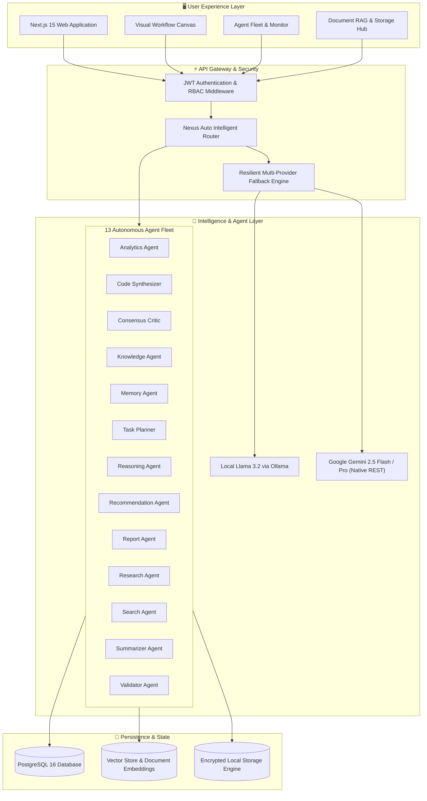

# NEXUS AI — Enterprise Architecture & System Design

NEXUS AI is built as a modular monorepo combining a high-performance **Next.js 15 App Router** frontend, a scalable **FastAPI** AI microservices gateway, a **PostgreSQL (Prisma ORM)** data layer, and a **13-Agent Python Mesh**.

---

## 🏛 System Topology

---

## 🧩 Architectural Pillars

### 1. Resilient Multi-Model Mesh
- Eliminates single-vendor vulnerability.
- If primary LLM providers face rate limits, billing exhaustion, or outages, requests automatically cascade across secondary verified models (Google Gemini 2.5 Flash/Pro, Gemini Flash Latest) without dropping the user's connection.

### 2. Autonomous Task Decomposition
- The **Task Planner** deconstructs complex user prompts into directed acyclic graphs (DAGs).
- Specialized sub-agents (Analytics, Code, Critic, Validation) execute parallel tasks with shared working memory.

### 3. Dual-Tier Memory Architecture
- **Working Session Memory**: Ephemeral sliding-window context tracking recent user turns and tool outputs.
- **Persistent Semantic Memory**: Vectorized long-term store enabling recall of enterprise facts, documentation, and user preferences across sessions.

### 4. Enterprise Multi-Tenancy & Compliance
- Full organization isolation (Organization ID scoped on every model query).
- Role-Based Access Control (`ADMIN`, `MEMBER`, `GUEST`).
- Token attribution tracking per request, user, and agent for transparent cost allocation.
